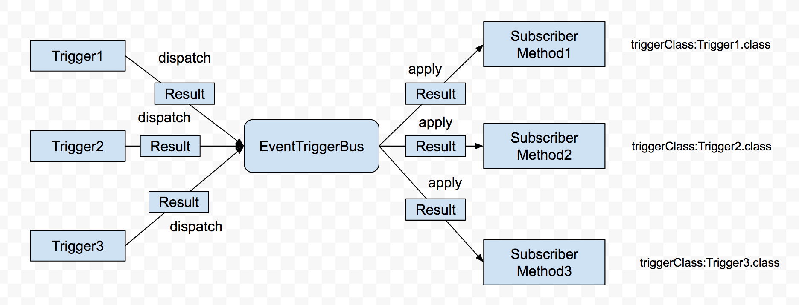

# EventTrigger : 为Android设计的事件触发框架

Android世界中离散发生的事件，我们都可以把它抽象成一个个触发器，事件因为某种原因发生了，可以抽象成触发器因为某种原因触发了，比如定义网络触发器，因为网络发生改变导致触发了网络触发器，因为时间到了，触发了计时触发器，于是便有了EventTrigger。当事件发生(触发)时，触发器处理结果，然后将结果派发给对应的类的方法处理。<br/>
<font color="#ff4500">欢迎大家都来fork和pull request，把这个框架变得更加完善</font>

### 开始使用EventTrigger
EventTrigger使用分为4步
-------------------
Step 1. 添加依赖<br/>
在build.gradle添加依赖
```gradle
compile 'cn.appleye.eventtrigger:library:1.0.2'
```

在maven中添加依赖
```xml
<dependency>
  <groupId>cn.appleye.eventtrigger</groupId>
  <artifactId>library</artifactId>
  <version>1.0.2</version>
  <type>pom</type>
</dependency>
```
Step 2. 定义触发器<br/>
框架中已经自带了触发器，你也可以自定义触发器，实现Trigger接口或者继承AbstractTrigger(实现了Trigger接口)，以TimerTrigger说明
```java
public class TimerTrigger extends AbstractTrigger{
    private static final String TAG = "TimerTrigger";

    /**时间间隔*/
    private int mInterval;
    /**是否结束*/
    private boolean mIsFinished;

    private static final int MSG_DELAY = 1000;

    /**发送延迟消息Handler*/
    private Handler mHandler = new Handler() {
        @Override
        public void handleMessage(Message msg) {
            switch (msg.what) {
                case MSG_DELAY:{
                    if(!mIsFinished){
                        dispatch(null);//派发结果
                        mHandler.sendEmptyMessageDelayed(MSG_DELAY, mInterval);
                    }
                    break;
                }
            }
        }
    };

    /**
     * 构造方法
     * @param observer 用于获取当前触发器结果的观察者
     * @param interval 时间间隔
     * */
    public TimerTrigger(Observer observer, int interval) {
        super(observer);

        mInterval = interval<0?100:interval;//小于0时，定义为100ms

        mIsFinished = false;
    }

    @Override
    public String getName() {
        return "TimerTrigger";
    }

    @Override
    public void setup() {//初始化工作
        if(mIsFinished) {
            throw new IllegalStateException("the timer has been stopped");
        }

        mHandler.sendEmptyMessage(MSG_DELAY);
    }

    @Override
    public void forceTrigger() {//强制调用
        //移除延迟消息
        mHandler.removeMessages(MSG_DELAY);
        //立刻执行
        mHandler.sendEmptyMessage(MSG_DELAY);
    }

    @Override
    public void stopTrigger() {//结束计时触发器
        mIsFinished = true;
    }
}
```
Step 3. 定义类的方法<br/>
```java
@TriggerSubscribe(className = CustomTrigger.class, loopMode = LoopMode.ALWAYS,
        strictMode = StrictMode.STRICT)
public void onTriggerChanged(Object result) {
    //TODO:处理派发的结果
}
```
注解TriggerSubscribe参数说明
* className - 表示目标触发器类，缺省Void.class
* loopMode - 表示调用模式， LoopMode.ALWAYS：只要触发器触发就调用，LoopMode.ONCE：调用完一次之后就不再调用，缺省LoopMode.ALWAYS
* strictMode - 表示严格模式， StrictMode.STRICT表示className对应的触发器必须要实现Trigger接口，StrictMode.ALLOW_ALL表示可以是任意触发器，不过所有调用都得自己来实现。缺省StrictMode.STRICT<br/>

Step 4. 初始化触发器和注册当前对象<br/>
EventTriggerBus实现了Observer接口，将其传入到触发器构造方法当中，触发器将结果派发之后传给EventTriggerBus处理
```java
//获取EventTriggerBus并且注册当前类
EventTriggerBus.getInstance().register(this)//注册当前对象
        .installLocalTrigger(this, CustomTrigger.class, Object[])//添加本地触发器(绑定的Activity、触发器类、触发器构造方法参数)
        .forceCallLocalTrigger(this, TimerTrigger.class);//强制调用触发器
```
不再使用的时候，需要注销当前对象
```java
EventTriggerBus.getInstance().unregister(object)
```
另外，经常会用到全局触发器，可以在Application初始化的时候，将实例化触发器即可，下面demo有使用详解
## Demo
-------------------
### 1.单个类中定义触发器
以TimerTrigger为例
```java
import android.support.v7.app.AppCompatActivity;
import android.os.Bundle;
import android.widget.TextView;

import java.util.concurrent.atomic.AtomicInteger;

import cn.appleye.eventtrigger.EventTriggerBus;
import cn.appleye.eventtrigger.annotations.TriggerSubscribe;
import cn.appleye.eventtrigger.triggers.Trigger;
import cn.appleye.eventtrigger.triggers.timer.TimerTrigger;

public class TimerTriggerActivity extends AppCompatActivity {

    /**显示计时信息控件*/
    private TextView mTimerInfoView;
    /**计数器*/
    private AtomicInteger mValue = new AtomicInteger(0);

    private EventTriggerBus mEventTriggerBus;
    /**计时器触发器*/
    private Trigger mTimerTrigger;

    @Override
    protected void onCreate(Bundle savedInstanceState) {
        super.onCreate(savedInstanceState);
        setContentView(R.layout.activity_timer_trigger);

        mTimerInfoView = (TextView) findViewById(R.id.timer_info_view);

        //获取EventTriggerBus并且注册当前类
        EventTriggerBus.getInstance().register(this)
                .installLocalTrigger(this, TimerTrigger.class,
                        new Object[]{ EventTriggerBus.getInstance(), 1000})
                .forceCallLocalTrigger(this, TimerTrigger.class);
    }

    /**
     * 添加注解，用于过滤和得到要订阅的方法
     * */
    @TriggerSubscribe(className = TimerTrigger.class)
    public void onTimerInfoChanged(Object result) {
        /*设置值*/
        mTimerInfoView.setText(mValue.getAndIncrement() +"");
    }

    @Override
    public void onDestroy() {
        super.onDestroy();
        //注销当前监听
        EventTriggerBus.getInstance().unregister(this);
    }
}
```

### 2.全局触发器用法
以NetworkTrigger为例<br/>
Step 1 : 首先在Application中定义全局触发器
```java
public class DemoApplication extends Application{
    private static final String TAG = "DemoApplication";

    @Override
    public void onCreate() {
        super.onCreate();

        setupGlobalTrigger();
    }

    /**
     * 初始化全局触发器
     * */
    private void setupGlobalTrigger() {
        EventTriggerBus.getInstance().init(this)
                .installGlobalTrigger(NetworkTrigger.class,
                new Object[]{ EventTriggerBus.getInstance(), this});
    }

    @Override
    public void onTerminate(){
        super.onTerminate();
        //移除所有触发器
        EventTriggerBus.getInstance().removeAllGlobalTriggers();
    }
}
```

Step 2 : 注册当前对象
```java
public class NetworkTriggerActivity extends AppCompatActivity {
    private TextView mNetworkView;
    private EventTriggerBus mEventTriggerBus;

    private static final int NETWORK_PERMISSION_REQUEST = 1000;

    @Override
    protected void onCreate(Bundle savedInstanceState) {
        super.onCreate(savedInstanceState);
        setContentView(R.layout.activity_network_trigger_demo);

        mNetworkView = (TextView) findViewById(R.id.network_info_view);

        //注册当前类
        mEventTriggerBus = EventTriggerBus.getInstance();
        mEventTriggerBus.register(this);

        forceNetworkTrigger();//立刻生效
    }

    @TriggerSubscribe(className = NetworkTrigger.class, loopMode = LoopMode.ALWAYS,
            strictMode = StrictMode.STRICT)
    public void onNetworkChanged(NetworkState networkState) {
        mNetworkView.setText(networkState.toString());
    }

    /**
     * 强制调用网络状态变化触发器
     * */
    private void forceNetworkTrigger(){
        //强制执行当前触发器
        mEventTriggerBus.forceCallGlobalTrigger(NetworkTrigger.class);
    }

    @Override
    public void onDestroy() {
        super.onDestroy();
        mEventTriggerBus.unregister(this);
    }
}
```

License
-------
Copyright (C) 2017-2018 Liaopu Liu

Licensed under the Apache License, Version 2.0 (the "License");
you may not use this file except in compliance with the License.
You may obtain a copy of the License at

<http://www.apache.org/licenses/LICENSE-2.0>

Unless required by applicable law or agreed to in writing, software
distributed under the License is distributed on an "AS IS" BASIS,
WITHOUT WARRANTIES OR CONDITIONS OF ANY KIND, either express or implied.
See the License for the specific language governing permissions and
limitations under the License.
